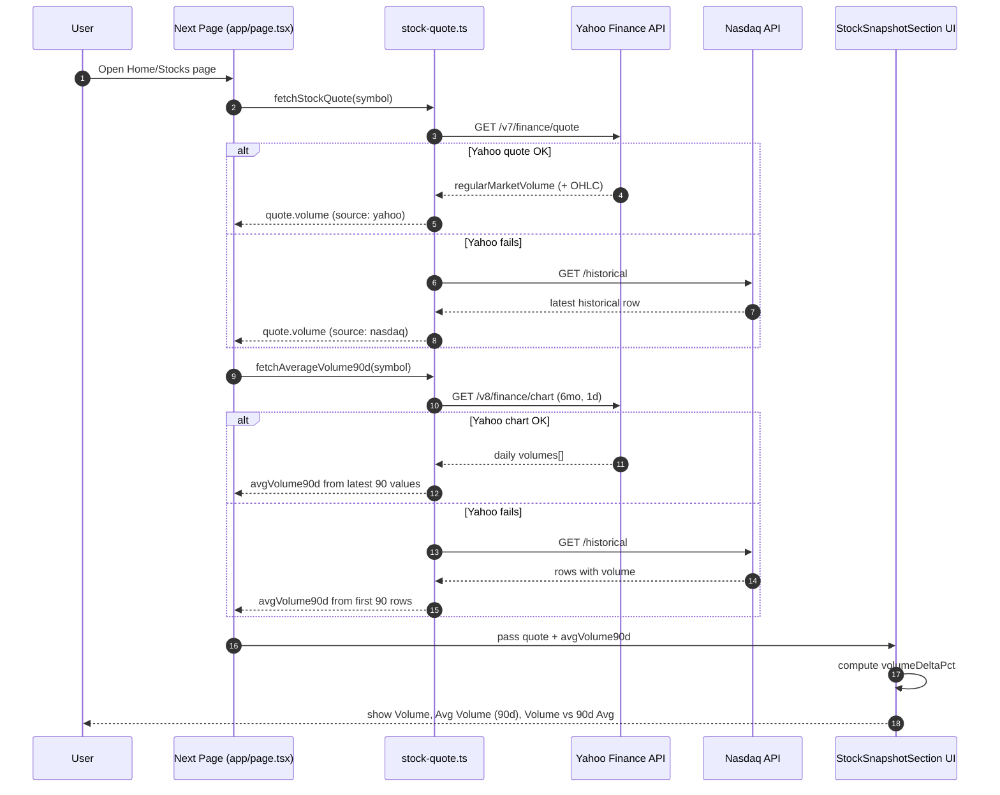
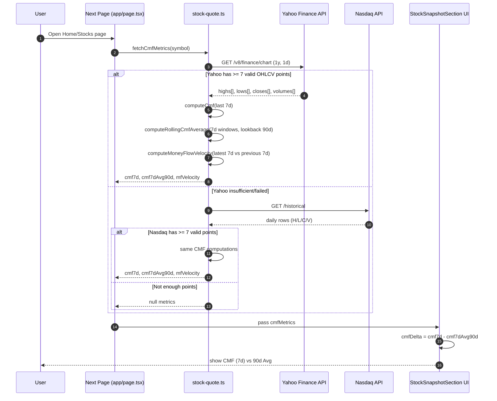

# Learn API Fetching Diagrams

This companion note visualizes how `volume` and `CMF` data move through this project.

## 1. Volume Flow (Request -> Provider -> Transform -> UI)

## 2. CMF Flow (Request -> OHLCV -> Metrics -> UI)

## 3. Data Shapes At A Glance

- `StockQuote.volume`: current session volume for the symbol.
- `avgVolume90d`: arithmetic mean of recent 90 daily volumes.
- `cmf7d`: CMF over last 7 days.
- `cmf7dAvg90d`: average of rolling 7-day CMF windows over recent lookback.
- `mfVelocity`: percent change between latest and prior 7-day CMF windows.

## 4. Where To Read In Code

- `app/page.tsx` and `app/stocks/page.tsx`
- `app/lib/stock-quote.ts`
- `app/components/stock-snapshot-section.tsx`

## 5. Suggested Learning Exercise

1. Add temporary `console.log` statements in `fetchCmfMetrics` and `fetchAverageVolume90d` to see which provider path (Yahoo or Nasdaq) is used in runtime.
2. Compare resulting UI values after changing `next: { revalidate: 60 }` to another interval.
